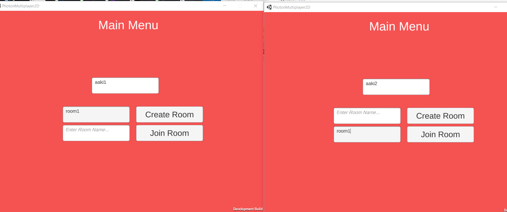
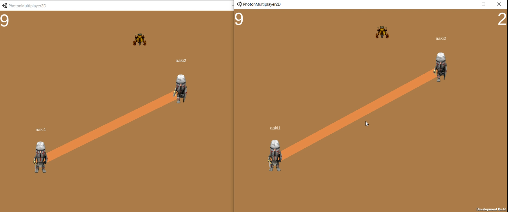
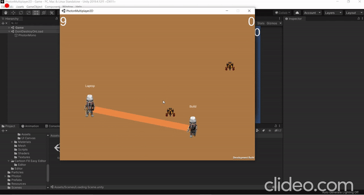

# PhotonMultiplayer2D
> Its a 2D multiplayer game created for a game jam. The topic of the game jam was 'Stay Connected" 

# Requirement 
> Unity Game Engine 2019.3.14f1 and Photon Engine Pun2

# Game Mechanics
> The core mechanics of the game is that 2 player is connected with each other with a line and they have to kill the hungry spiders with the line they are connected with.  

# Snapshots

